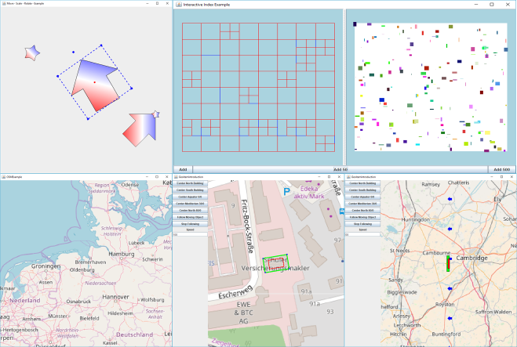
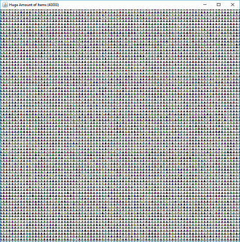
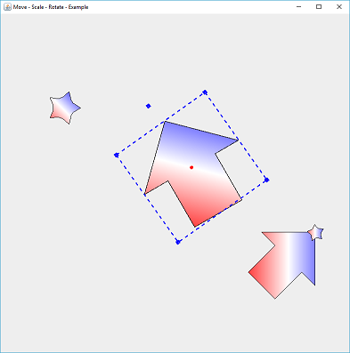
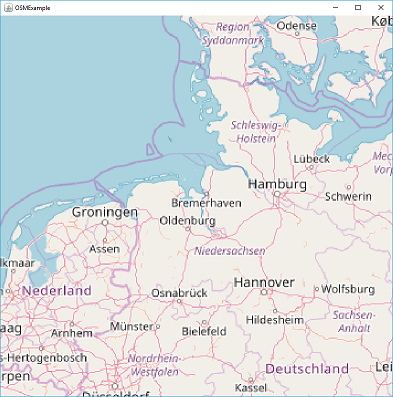
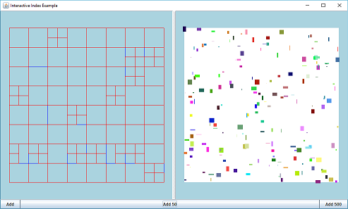
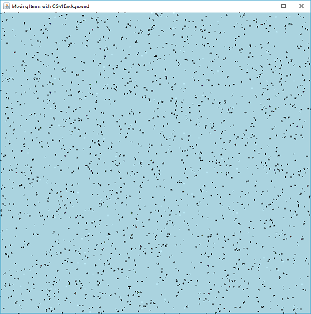
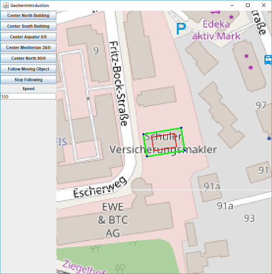
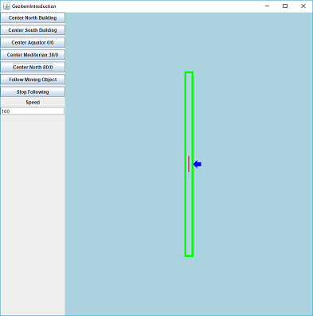
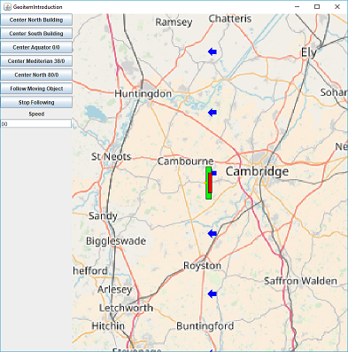
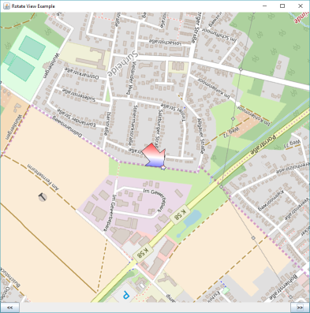

GraphicsView
===========================
The GraphicsView project reproduces QT's well-known ["Graphics View Framework"](http://doc.qt.io/archives/qt-4.8/graphicsview.html) for Java.

The focus is on decoupling from the graphics scene, in which all objects are defined, and the GraphicsView, which offers a specific view of a scene. 

# Why using GraphicsView
## Features of GraphicsViewCore
* **Easy to use** : Adding an Item requires only three lines of code
* **Familiar Coordinate System** : make use of the more familiar coordinate system (positive x to the right, positive y to **up**)
* **Multiple View Support** : You can use different views on the same scene
* **Easy interaction with graphical items**
	* Select
	* Move
	* Rotate
	* Scale
* **Fast Index Structures** : Different Storage strategies can be used to organize the items within a scene and to speedup the selection of items 
* **Reuse of Shapes** : An shape (java2D) can be used in multiple items
	* **Designs** : Use designs to change the visual behaviour of items, even if they do share the same shape
* **Item Hierarchies** : Items can be organized into Item - Hierarchies, similar to an 3D Scenegraph 
* **Independent Mouse Support for each Item**: Each Graphical Item can make use of its own Mouse Handlers
	* MouseListener
	* MouseMotionListener
	* MouseWheelListener
* **Unlimited Zooming**: No limitiations for zoom levels
* **Easy observation of Changes**: each item can be observed, wheater one of its parameters has been changed
* **Custom Drawables** : The optical representation of an item can easily been changed
* **Z-Order**: Define which item shall overpaint all others
* **Rotate View**: rotate the view without changing anything in the model or drawing
 
## Features added by GeoGraphicsView
* **Tile Support** : The GeoGraphicsView supports different TileFactories, that could even be mixed
	* OSM
	* Google
	* WMS
* **Scale Aware Geographic Shapes** : automatic correction of scaling effects, based upon the Projection from WGS84 coordinates to [Web Mercator](https://en.wikipedia.org/wiki/Web_Mercator)
* **Memory Aware Caching** : Tile Images can be efficiently (Memory and Performance) organized into hierarchical caches. Each cache takes care of its own memory consumption.

* **No dependencies** : plain java and java2D is used 

# Examples

## Source Code Examples
* SelectionExample.java : Demonstrates how to add Items and how to use the SelectionHandler to select them
* RotationExample.java : Demonstrate how Items could be rotated, as well as the effect to their bounding box
* LotsOfItemsExample.java: 
	* Demonstrate the performance of the GraphicsView with a lot of independend items (40000 items)
	* 	
* MoveScaleRotateItemExample.java : 
	* Demonstrate how to interact with an item and how this interaction can be customized
	* 
* OSMExample.java : 
	* Demonstrates how to add OSM background
	* 
* InteractiveIndexExample: 
	* Demonstrate the used Quadtree Storage strategy
	*  
* MovingItemsWithOSMBackground: 
	* Performance Demonstration for 40000 items that do move through the scene
	* 
* GeoItemsIntroduction.java: 
	*demonstrates the scale effect when using WebMercator projections and how to solve the issue with GeoGraphicsView
	* 
	* 
	* 
* RotateViewExample.java: 
	* Demonstrate how to rotate the view
	* 
	
# Similar Projects 
The following projects have some kind of similar objectives but none of them could fullfill all requirements. However all of them have been used as inspiration. 

* [JXMapViewer](https://github.com/msteiger/jxmapviewer2)
* [OpenMap (BBN)](https://github.com/OpenMap-java/openmap)
* [Graphics2D](https://docs.oracle.com/javase/7/docs/api/java/awt/Graphics2D.html)
* [MxGraph](https://github.com/jgraph/mxgraph)